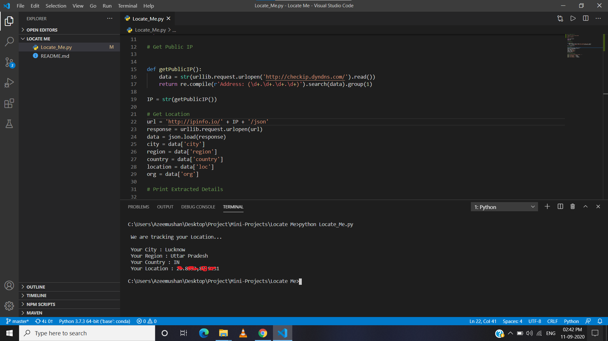

# Locate Me
This is a python script which finds out your IP Address and location details according to the public IP.  

## To Run the script
- Clone the repository using git.
- Opent the folder in Python IDE and make sure you are connected to internet.
- Run Locate_Me.py in Python IDE.

### Screenshots

